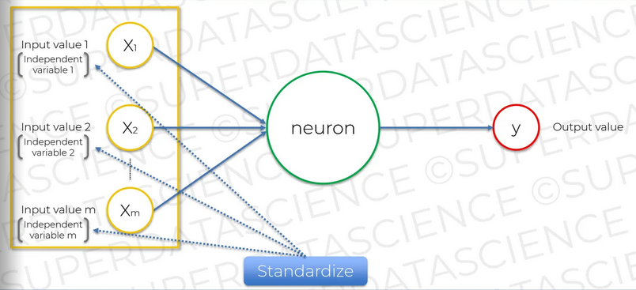
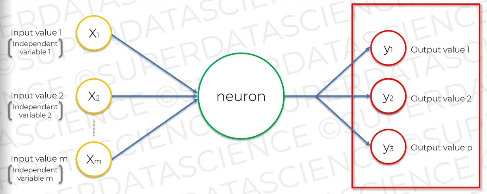
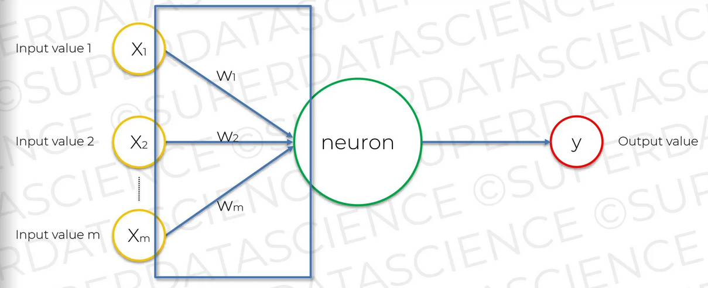
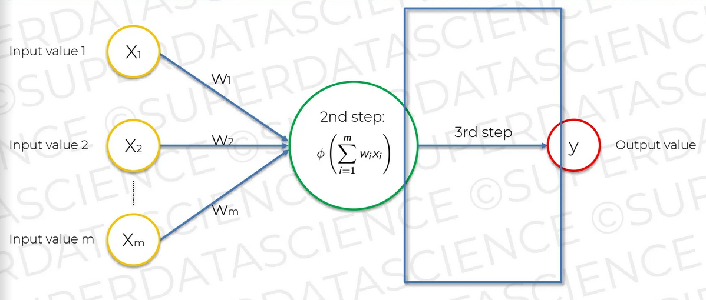

## Chapter 8. The Neuron

뉴런은 노드라고도 불린다. 인풋과 아웃풋이 존재한다. 인풋은 다른 뉴런을 의미한다. 

- 인풋 값(뉴런)은 모두 독립적인 변수를 사용한다. 독립적인 변수란 x1은 나이, x2는 학력, x3는 연봉 등 서로 독립적인 의미를 갖는 데이터를 의미한다.
- 인풋 값은 표준화 혹은 정규화 된 값을 사용한다.
  - 인풋 값은 표준화(standardize) 된 값을 사용한다. 표준화한다는 것은 평균 값을 0으로 하여 표준편차를 1을 가지도록 변환하는 과정이다. 정규 분포를 따르는 데이터로 변경할 수 있지만, 값의 범위가 특정되지 않아서 0~1 사이의 값이 필요할 때 부적합하다.
  - 인풋 값은 정규화(normalize) 된 값을 사용한다. 최대 값에서 최소 값을 0에서 1 사이의 값을 가지도록 변환하는 과정이다. 데이터가 0~1 사이로 변해서 모델이 더 쉽게 학습할 수 있다. 다만 이상치(outlier)가 있는 경우 값이 왜곡될 수 있다.

  <kbd>
    
  </kbd>

아웃풋 값은 다음과 같은 값이 될 수 있다.

- 연속된 값(e.g. price)
- 이진 값(e.g. true, false) 
- 카테고리. 카테고리의 경우 출력 값이 여러 개기 될 수 있다.

  <kbd>
    
  </kbd>

시냅스는 가중치를 할당 받는다. 모델이 학습한다는 의미는 가중치가 변경된다는 의미이다. 어떤 신호가 중요하고 아닌지 결정하는 것이 시냅스의 가중치다.

  <kbd>
    
  </kbd>

뉴런에서는 다음과 같은 일이 일어난다.

1. 모든 인풋 값과 가중치가 곱해진 값이 더해진다.
2. 더해진 값이 활성화 함수에 적용된다. 
3. 활성화 함수 결과에 따라 신호를 전달하거나 하지 않는다.

  <kbd>
    
  </kbd>

