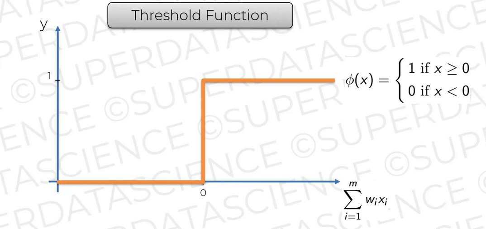
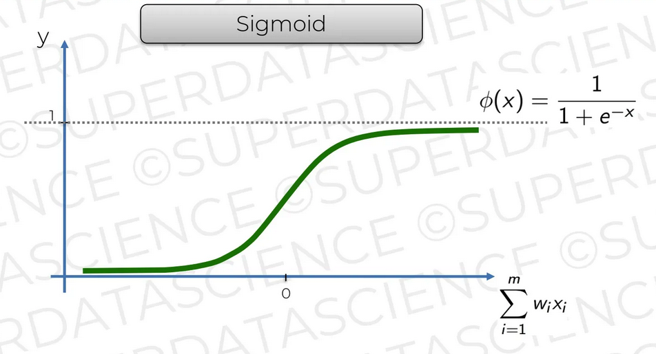
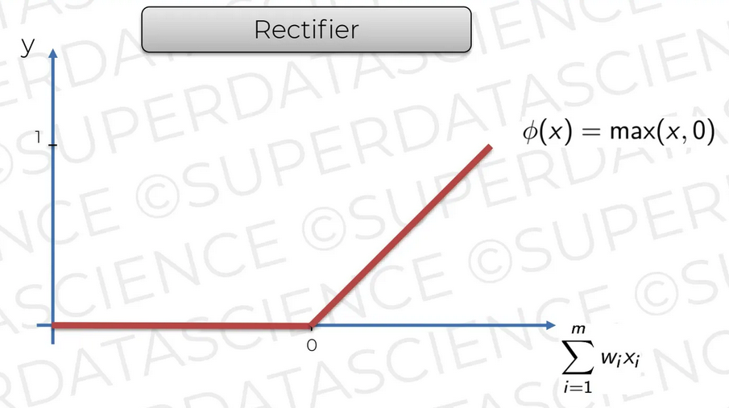
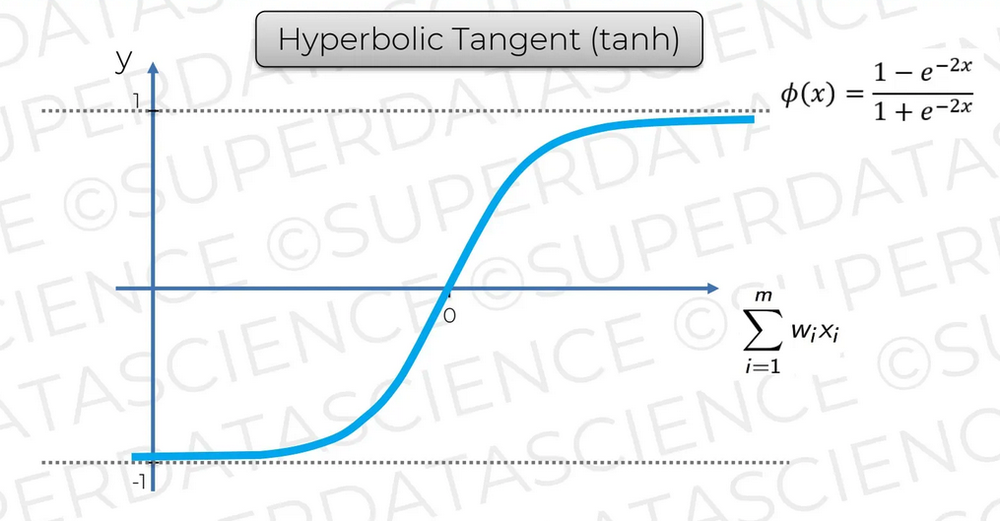
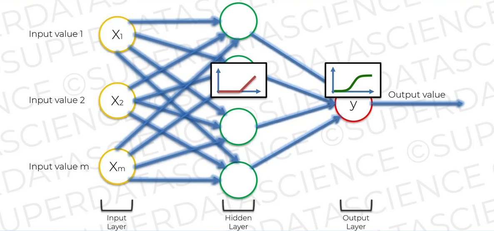

## Chapter 9. Activation Function

4개의 다른 활성화 함수(activation function)이 존재한다. 스레쉬홀드(threshold) 함수는 이진 결과를 낸다.

  <kbd>
    
  </kbd>
   

시그모이드(sigmoid) 함수는 값이 연속된 값을 가지며 결과 계층에서 사용하는 것이 좋다.

<kbd>
  
</kbd>

 

렉티파이어(rectifier) 함수는 0 이후에 값이 선형적으로 증가하는 함수다.

<kbd>
  
</kbd>

 

하이포볼릭 탄젠트(hyperbolic tangent) 함수는 시그모이드와 비슷하지만, 결과 값이 -1에서 1까지 범위를 갖는다.

<kbd>
  
</kbd>

 

각 뉴런에는 활성화 함수가 적용된다. 인풋 값과 가중치 값의 곲이 모두 더해진 후 활성화 함수를 통과해서 얻은 결과를 다음 계층으로 전달한다. 아래 예시는 히든 레이어에서는 렉티파이어 함수, 결과 층에서는 시그모이드 함수를 사용한 예시이다.

<kbd>
  
</kbd>

 
