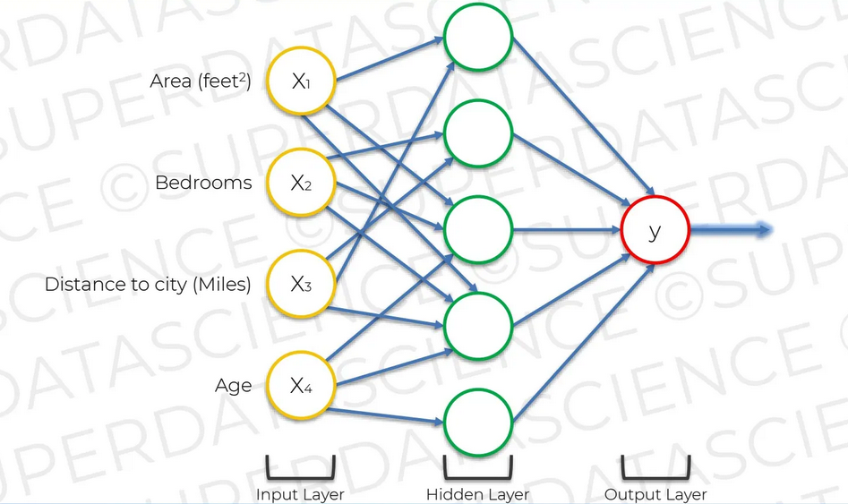

## Chapter 10. How do NNs Work?

히든 레이어에 위치한 뉴런에 연결할 때 모든 인풋들이 연결되는 것이 아니다. 각 항목에 대해 관심 있는 항목들만 뉴런에 연결한다. 하나의 인풋만 사용해도 되고 모든 인풋들을 사용하는 것도 가능하다. 학습 관심사에 따라 인푹 항목을 적절하게 결정하면 된다. 

  <kbd>
    
  </kbd>

