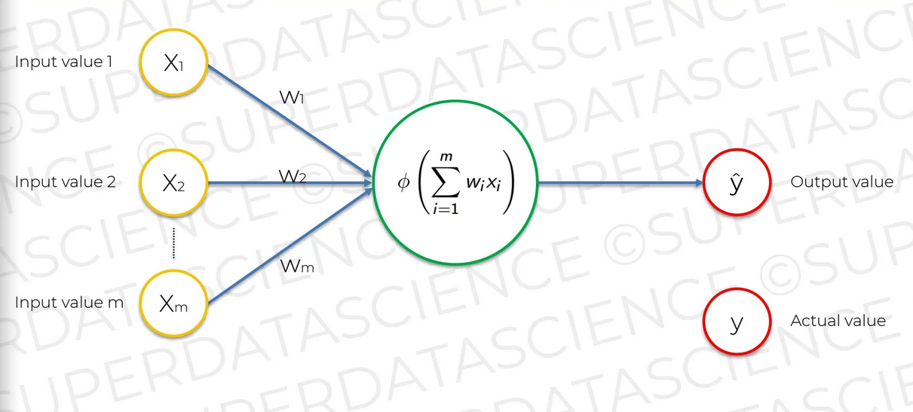
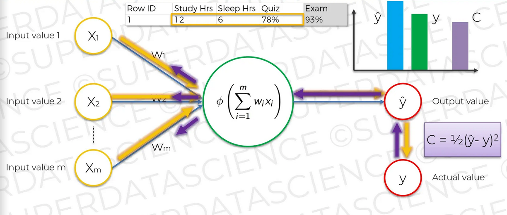

## Chapter 11. How do Neural Networks learn?

아래 그림 같은 구조를 단층 피드 포워드 신경망(퍼셉트론)이라고 한다. 신경망의 결과 값을 `y`라고 하지 않고 `^y`라고한다. y는 실제 값이고, ^y이 인공지능의 결과 값이라 이를 구분한다.

  <kbd>
    
  </kbd>

학습하려면 아웃풋 값과 실제 값을 비교해야한다. 비교할 때 사용하는 함수를 `비용 함수(cost function)`라고 한다. 비교하는 함수는 함수는 여러 개가 존재한다. 비용 함수의 결과를 최소한(최종적으로 0)으로 줄이기 위해 가중치를 조정한다. 

  <kbd>
    
  </kbd>

데이터 셋이 여러 개의 로우(row)로 이뤄져있는 경우 비용 함수 결과를 모두 더한다. 더한 값을 0으로 만들기 위해 가중치를 조정한다. 

  <kbd>
    
  </kbd>

데이터 셋이 많을수록 모든 데이터 셋을 만족할 수 있는 가중치를 구하기 때문에 모든 케이스에 대해 비용을 최소한으로 줄일 수 있는 가중치가 구해진다. 비용 함수 결과를 최소한으로 줄이기 위해 가중치를 조절하는 방법을 역전파(back propagation)라고 한다. 데이터가 많을수록 정확도가 높아질 수 있다는 인사이트를 얻을 수 있다.
