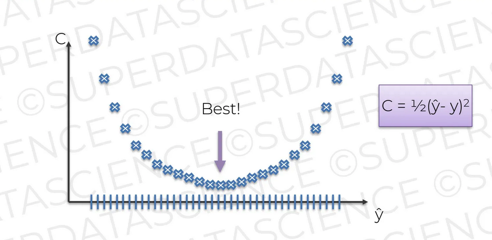
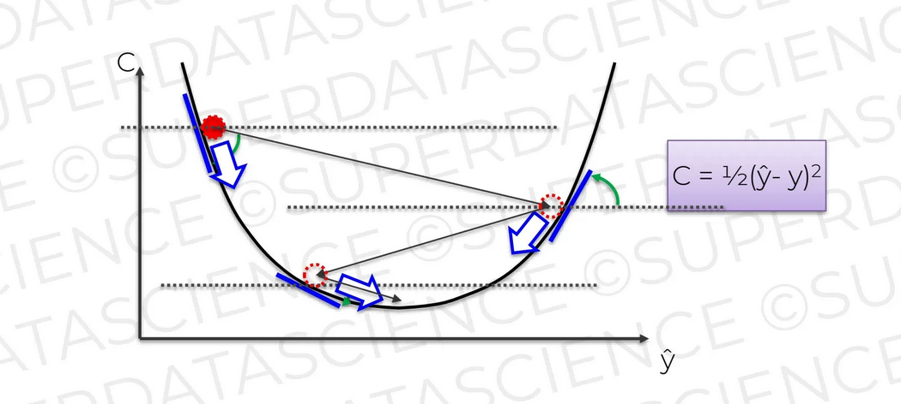

## Chapter 12. Gradient Descent(경사 하강법)

최소한의 비용 함수 결과를 찾기 위해선 어떤 방식의 접근법이 필요할까? 얘를 들어 엄청 많은 가중치 셋을 갖고 모든 결과를 비교한다. 각 가중치에 변경되는 아웃풋(^y) 비용 함수 결과가 최소화가 지점을 찾는다. 이를 무차별 대입 방식이라고 하지만, 굉장히 많은 비용이 소모된다. 무차별 대입은 차원의 저주(curse of dimension)에 빠진다. 

  <kbd>
    
  </kbd>

조금 다른 방식의 접근이 필요하다. 경사 하강법(gradient descent)은 비용 함수 그래프에서 특정 지점의 기울기를 확인한다. 기울기에 따라 기울기 값이 반대로 변경되는 아웃풋 값을 찾아가면서 기울기가 최종적으로 0이 되는 지점을 찾는다.

  <kbd>
    
  </kbd>

