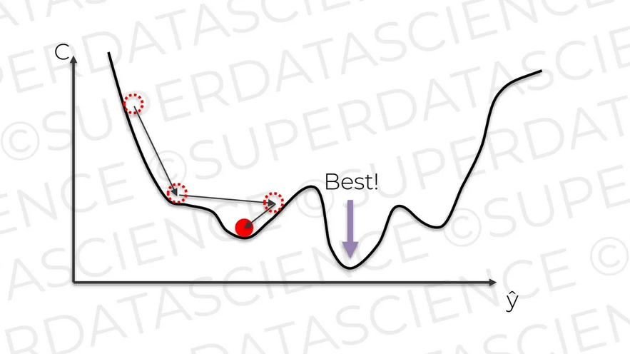
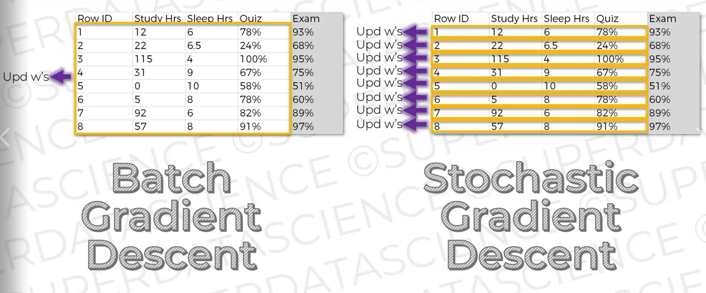

## Chapter 13. Stochastic Gradient Descent(확률적 경사 하강법)

경사 하강법의 문제점은 비용 함수의 변곡점(inflection point)가 한 곳이어야 한다는 점이다. 변곡점이 여러 개인 경우 지역 최소점(local minima)에 갇힐 수 있다. 실제 전역 최소값(global minimum)은 다른 지역에 있지만, 경사 하강법을 따라 움직이면 특정 지역의 최소 점에서 머문다.

  <kbd>
    
  </kbd>

이런 문제점을 해결하기 위해 약간 변행된 확률적 경사 하강법(stochastic gradient descent)을 사용한다. 실제 위에서 언급한 경사 하강법은 배치 경사 하강법(batch gradient descent)라고 한다. 배치 경사 하강법은 모든 샘플 데이터를 모두 적용하고, 마지막에 가중치를 적용한다. 확률적 경사 하강법은 모든 샘플 데이터를 한번에 실행하고 가중치를 변경하지 않는다. 하나의 로우를 적용하고 즉시 가중치를 변경한다. 확률적 경사 하강법은 지역 최소점에 빠지는 함정을 피하는데 도움이 된다.

  <kbd>
    
  </kbd>

조금 더 발전시켜서 미니 배치 경사 하강법(mini batch gradient descent)을 사용하기도 한다. 미니 배치 경사 하강법은 배치 사이즈를 5, 10 단위로 지정하여 경사 하강법을 적용한다.
